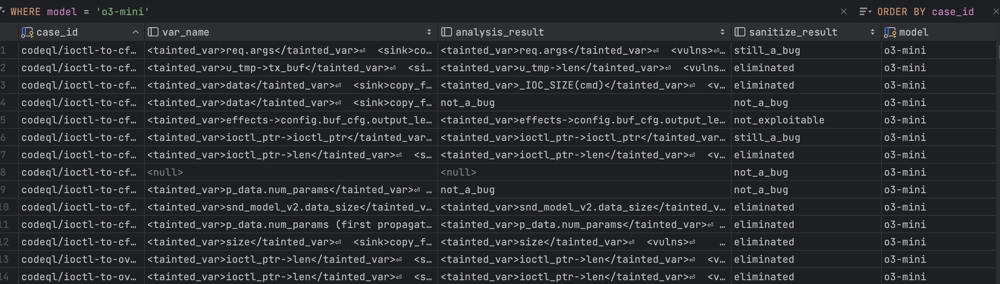
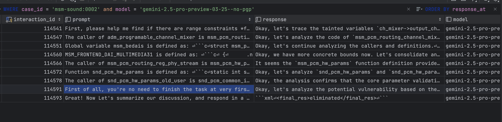

# BugLens

BugLens is a tool that uses LLMs to refine static analysis results. It focus on "taint-style" bugs. Experiments on Linux kernel code show that it can improve the precision by 7x and can also help with recall (for those bugs that are ignored by human reviewers).

The paper is available at https://arxiv.org/abs/2504.11711

# Quick Start


- Step 0: git clone `git clone https://github.com/seclab-ucr/BugLens.git --recurse-submodules && cd BugLens` and set up your API keys in `.env` file (see `docker-compose.yml` for the keys needed)
- Step 1: docker run `docker compose up --build`, it will build the docker image and start the container (database + app)
- Step 2: open another terminal, and run `docker exec -it buglens-app bash` to get into the container, the runner is in `app/run.py`


## Source Code

The source code is available at [BugLens-Code](https://github.com/seclab-ucr/BugLens-Code)

## Requirements

### Database 

BugLens relies on postgres database to store the results (cases), and also logging the interactions with the LLMs (llm-logs)





Their schema is defined in the `db` folder. You can use the `cases.sql` and `llm_logs` to create the database.

### Configuration

The configuration file is in `config.py` (`common/config.py`), by default, there are two main settings: `proj_config` and `db_config`:

For example, the `proj_config` is defined as follows:

```python
PROJ_CONFIG = { 
    "msm-sound":{
        "proj_dir": __MSM_DIR,
        "cmd_file": "all_sound.cmd",
    },
    "codeql/ioctl-to-cfu": {
        "proj_dir": "../msm-4.4-revision-2017-May-07--08-33-56/src/home/kev/work/QualComm/semmle_data/projects/msm-4.4/revision-2017-May-07--08-33-56/kernel",
        "sarif_file": "results.sarif",
    },
}
```

The "proj_dir" is the directory of the source code to be analyzed, "cmd_file" is the command file that contains the **results** of the static analysis tool (weird to call "cmd", but that's what Suture does). The "sarif_file" is the output file of the static analysis tool (for CodeQL, obviously).


And the `db_config` is defined as follows, indicating the database connection information:

```

DB_CONFIG = {
    "host": "localhost",
    "port": 5432,
    "dbname": "lmsuture",
    "user": "lmsuture_user",
    "password": "password1",
}

```

### API Keys

BugLens requires multiple API keys to work with different LLMs. It will automatically load the keys from the environment variables and files. Used in 
`prompts/call_api.py`:

```python
api_key = "../openai.key"
if 'OPENAI_API_KEY' not in os.environ:
    if os.path.exists(api_key):
        key_chain = open(api_key, 'r').read().splitlines()[0]
        os.environ['OPENAI_API_KEY'] = key_chain
```

You will need to set the following keys:

- `OPENAI_API_KEY` (openai.key)
- `DEEPSEEK_API_KEY` (deepseek.key)
- `GEMINI_API_KEY` (gemini.key)
- `ANTHROPIC_API_KEY` (claude.key)
- `OPENROUTER_API_KEY` (openrouter.key)

You can set dummy keys for the ones you don't want to use (or comment out the code that uses them).